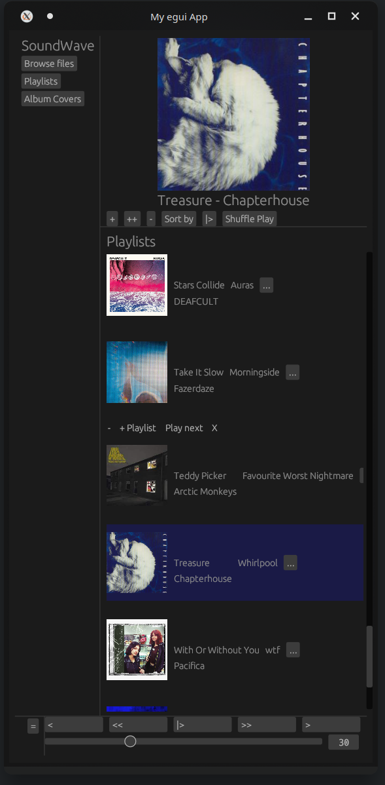

# SoundWave
A music player built with rust, egui and gstreamer.
It works on both linux and windows and is meant for people who love creating playlists

# Instalation guide
- Install VS C++ buildtools
- install programming language rust
- install gstreamer mscv normal and devel https://gstreamer.freedesktop.org/download/

- Add gstreamer to path var

    - This command will temporaily acomplish this on windows:
    set PATH=C:\gstreamer\1.0\msvc_x86_64\bin;%PATH%

- run with cargo from rust
